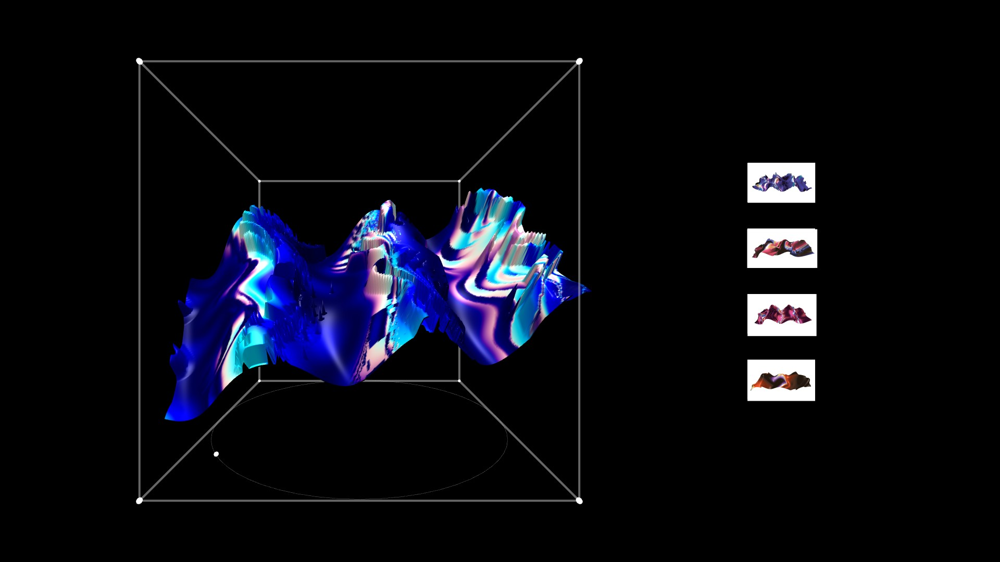

# RisOSC

RisOSC. Escrituras sobre lo escaso multiplicado y lo efímero único.

Impresiones risográficas con identificadores NFC y esculturas 3D. Se divide en 5 partes:

- Web. Páginas que se abren en dispositivos móviles o en el escritorio cuando una etiqueta NFC es leída.
- Server. Gestión de lecturas y envío de mensajes vía sockets a la página general y a las páginas específicas.
- Firmware. Dispositivo personalizado que lee etiquetas NFC, en este caso no es necesario un teléfono.
- Export. Los renders pueden exportarse como OBJs para usarse en otros contextos.
- Scripts. La página principal puede ejecutarse en una computadora de manera automática para la exhibición.

Presentada en el marco de la muestra Algorítmica Íntima en Centro Cultural Grupo Afirme. Ciudad de México 2025.

## Requerimientos

- Sevidor con el despliegue de web y server. 
- Computadora que despliegue la página principal. En esta computadora corre la proyeción. 
- Proyector (1920x1080). En caso de que la resolución no coincida, se puede ajustar. 
- Conexión constante a internet. 

## Agradecimientos

- Emmanuel Martínez (Algorítmica Íntima)
- Marianne Teixido (RAM Laboratoria)
- Editorial Uroboros 
