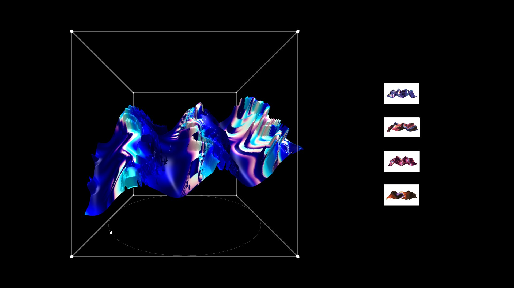

# RisOSC

RisOSC. Escrituras sobre lo escaso multiplicado y lo efímero único.

Impresiones risográficas con etiquetas NFC y esculturas 3D interactivas, controladas por web, servidor, firmware, exportador 3D y scripts de proyección automática.

---

## Estado del proyecto

### Durante la exhibición

La pieza fue exhibida como instalación física. Cada vez que un visitante acercaba una impresión risográfica al lector NFC, se generaba una visualización 3D única con Three.js e Hydra y se capturaba un snapshot comprimido en base de datos. El frontend en `web/` es el registro de esa versión — se conserva sin modificaciones.

Las seis partes originales de la instalación:

- **Web** (`web/`): Visualizaciones interactivas generadas con Three.js y Hydra. Responden en tiempo real a activaciones de NFC y entran en modo de demostración automática cuando no hay actividad. Accesible en `/web`.
- **Server** (`server/`): Servidor Express con WebSocket que gestiona lecturas de NFC y transmite eventos a los clientes web.
- **Firmware** (`firmware/`): ESP32 con lector PN532 que detecta etiquetas NFC y activa interacciones. Controla estados con LED RGB y funciona según horario programado.
- **Export** (`exporter/`): Herramienta web para deformar mallas 3D y exportar modelos GLB.
- **Scripts** (`scripts/`): Configuración de modo kiosk en Debian para proyección continua.
- **Dashboard** (`web/src/dashboard.html`): Monitoreo de interacciones. Accesible en `/dashboard`.

### Post-exhibición

Una vez concluida la instalación, el proyecto evoluciona como exploración del dataset generado. Se añade `site/` como nueva raíz del servidor:

- **Site** (`site/`): Página única que combina el archivo visual del dataset con síntesis granular interactiva. Muestra el mosaico completo de snapshots capturados durante la exhibición. Al cargar un archivo de audio, cada celda del mosaico puede controlarse con click — las propiedades visuales del snapshot (brillo, contraste, complejidad) modulan el granulador en tiempo real. Accesible en `/`.

## Requerimientos y Montaje

### Equipo necesario

- Proyector o pantalla (no se requiere resolución específica).
- Computadora para ejecutar la web y el servidor.
- Cable HDMI o conexión compatible con el proyector/pantalla.
- Base o soporte para el proyector (si aplica) para ajustar altura y ángulo.
- Impresiones risográficas con etiquetas NFC integradas.
- Firmware ESP32 con lector PN532 (controlador NFC).
- Conexión a internet estable para sincronización y notificaciones web.

### Montaje físico

1. Colocar las impresiones risográficas en el espacio de exhibición.
2. Asegurar que las etiquetas NFC sean accesibles al lector (ESP32 + PN532).
3. Posicionar el proyector o pantalla sobre su base o soporte, apuntando a la superficie deseada.
4. Conectar la computadora al proyector/pantalla vía HDMI o método equivalente.
5. Colocar el lector NFC en un lugar donde pueda leer fácilmente las etiquetas de las impresiones.

### Montaje virtual

1. En la computadora que controla la proyección:

    - Ejecutar ```npm install``` para instalar dependencias.
    - Levantar el servidor con ```npm start``` o ```pm2 start server/app.js --name risosc```.
    - Generar los archivos estáticos de la web con ```npm run build``` si es necesario.

2. Asegurarse que la computadora esté conectada a la red WiFi que utiliza el firmware.

3. Verificar que el ESP32 con NFC esté encendido y funcionando dentro del horario programado.

4. Cada vez que se acerque una etiqueta NFC al lector, se enviará un índice al servidor y la web actualizará la proyección en tiempo real.

### Notas

- Ajustar la altura del proyector o posición de la pantalla para que la visualización sea óptima.
- Las etiquetas NFC deben estar firmes y visibles para una lectura confiable.
- La sincronización entre hardware y software depende de una red WiFi estable y la correcta configuración del firmware (env.h).

## Web y server

### Instalación

Clonar el repositorio y desde la raíz del proyecto:

```npm install```

Esto instalará todas las dependencias de server y web.

### Desarrollo

Para trabajar en la app histórica (`web/`) con recarga automática:

```
npm run dev
```

Esto levanta la aplicación web con Parcel (`web/src/index.html`) en modo desarrollo en el puerto 1234.

El servidor Express + WebSocket se puede correr por separado con:

```
npm start
```

`site/` no requiere compilación — se sirve directamente como archivos estáticos.

### Producción local

Para compilar la app histórica y servirla desde Express:

```
npm run build
npm start
```

`npm run build` genera los archivos estáticos en `dist/`.

`npm start` levanta el servidor Express en el puerto 3000, que sirve:

| Ruta | Contenido |
|------|-----------|
| `/` | `site/` — explorador granular post-exhibición |
| `/web` | `dist/` — app Three.js de la instalación original |
| `/dashboard` | Panel de monitoreo de interacciones |
| `/lib/treslib/` | Módulos granulares de treslib (servidos para `site/`) |

### Producción con PM2

Si deseas ejecutar el servidor en segundo plano y con reinicio automático:

```
npm install -g pm2   # solo la primera vez
npm run build         # generar archivos estáticos
pm2 start server/app.js --name risosc
pm2 save
```

Para actualizar o reiniciar el servidor:

```
pm2 restart risosc
```

Esto mantiene la aplicación corriendo en segundo plano incluso si cierras la terminal.

Los archivos estáticos en `dist/` ya deben estar construidos previamente con `npm run build`.

## Firmware

### Configuración

1. Copia `src/env.h.example` a `src/env.h`.
2. Configura tu WiFi y la URL del servidor.
3. Carga el código al ESP32 desde Arduino IDE o PlatformIO.

### Horario de funcionamiento

- Se define en `startHour`, `startMinute`, `endHour`, `endMinute`.
- Puede cruzar medianoche.

### Estados del LED RGB

- Amarillo: Esperando etiqueta
- Azul: Leyendo etiqueta
- Rojo: Etiqueta leída, sin coincidencia
- Verde: Coincidencia encontrada
- Gris oscuro: Cooldown (pausa antes de la siguiente lectura)

### Compilación y carga

1. Instalar librerías: `NfcAdapter`, `PN532`, `WiFi`, `HTTPClient`.
2. Abrir `main.ino` en Arduino IDE.
3. Seleccionar placa ESP32.
4. Cargar el firmware.

## Scripts

Los scripts de configuración se encuentran [aquí](./scripts/README.md).

## Agradecimientos

- Emmanuel Martínez (Algorítmica Íntima)
- Marianne Teixido (RAM Laboratoria)
- Editorial Uroboros 
